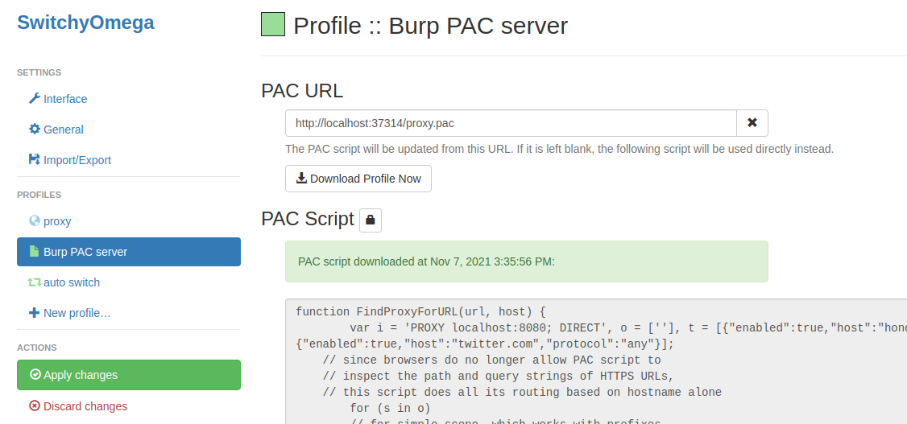

# Burp PAC Server

This Burp Extension generates a dynamic [Proxy Auto-Configuration (PAC)](https://developer.mozilla.org/en-US/docs/Web/HTTP/Proxy_servers_and_tunneling/Proxy_Auto-Configuration_PAC_file) script that will route traffic to your Burp proxy *only* if it matches the scope defined in your Burp target, e.g.:

```javascript
function FindProxyForURL(url, host) {
	var proxy = 'PROXY localhost:8080; DIRECT';
    var simple_scope = [];
    var advanced_scope = [
        {"enabled":true,"host":"example.com","protocol":"any"},
        {"enabled":true,"host":"twitter.com","protocol":"any"}
    ];

    // since browsers do no longer allow PAC script to
    // inspect the path and query strings of HTTPS URLs,
    // this script does all its routing based on hostname alone
	for (s in simple_scope)
        // for simple scope, which works with prefixes
        // we need to strip of anything following the third /
        // and compare to the hostname
        if(simple_scope[s].startsWith('https:')) {
            if (simple_scope[s].length > 0 && url.indexOf(simple_scope[s].substring(0, simple_scope[s].indexOf('/', 8))) == 0)
			    return proxy;
        } else {
            // if http we can compare full urls still:
            if (simple_scope[s].length > 0 && url.indexOf(simple_scope[s]) == 0)
			    return proxy;
        }
		
	for (s in advanced_scope)
		if (advanced_scope[s].enabled && shExpMatch(host, advanced_scope[s].host))
			return proxy;
	return 'DIRECT';
}
```

To use the Burp PAC Server extension:
1. Download `./build/libs/burp-pac-server-all.jar` from this repository;
2. In Burp Extender, browse to your downloaded file and add the JAR;
3. When the extension is loaded and enabled, the PAC server will spin up immediately, and the dynamic script is available on `http://localhost:37314/proxy.pac`
4. You can now configure your favorite browser plugin to point to this script, e.g.:
    * FoxyProxy:
        1. Go to FoxyProxy options;
        2. Add a new proxy;
        3. Select "Automatic proxy configuration URL";
        4. Enter the URL http://localhost:37314/proxy.pac
        5. Click View or Test to test the configuration
        
    * SwitchyOmega
        1. Go to SwitchyOmega options;
        2. Create a new profile;
        3. Select PAC profile
        4. Enter the URL http://localhost:37314/proxy.pac
        5. Note that in SwitchyOmega, you will need to manually refresh the PAC script every time you make changes to your scope in Burp.
        